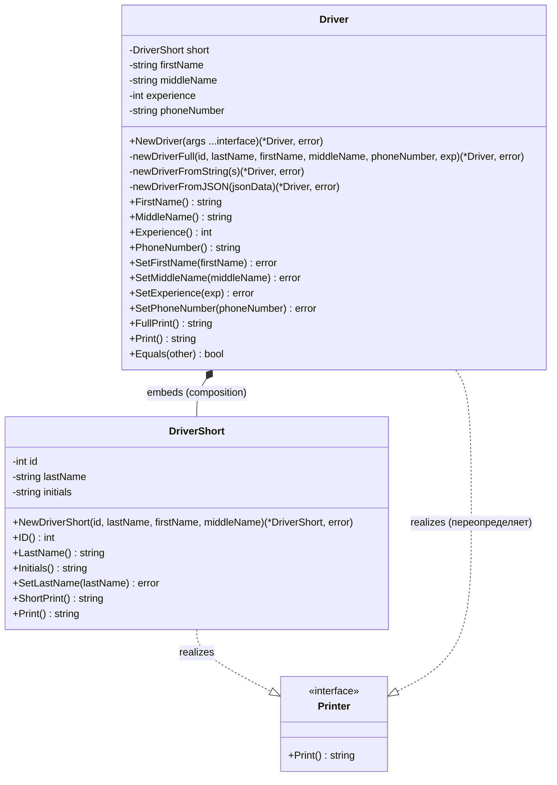

```mermaid
classDiagram
    class Printer {
        <<interface>>
        +Print() string
    }

    class DriverShort {
        -int id
        -string lastName
        -string initials
        +NewDriverShort(id, lastName, firstName, middleName) (*DriverShort, error)
        +ID() int
        +LastName() string
        +Initials() string
        +SetLastName(lastName) error
        +ShortPrint() string
        +Print() string
    }

    class Driver {
        -DriverShort short
        -string firstName
        -string middleName
        -int experience
        -string phoneNumber
        +NewDriver(args ...interface) (*Driver, error)
        -newDriverFull(id, lastName, firstName, middleName, phoneNumber, exp) (*Driver, error)
        -newDriverFromString(s) (*Driver, error)
        -newDriverFromJSON(jsonData) (*Driver, error)
        +FirstName() string
        +MiddleName() string
        +Experience() int
        +PhoneNumber() string
        +SetFirstName(firstName) error
        +SetMiddleName(middleName) error
        +SetExperience(exp) error
        +SetPhoneNumber(phoneNumber) error
        +FullPrint() string
        +Print() string
        +Equals(other) bool
    }

    Driver *-- DriverShort : embeds (composition)
    DriverShort ..|> Printer : realizes
    Driver ..|> Printer : realizes (переопределяет)
```
