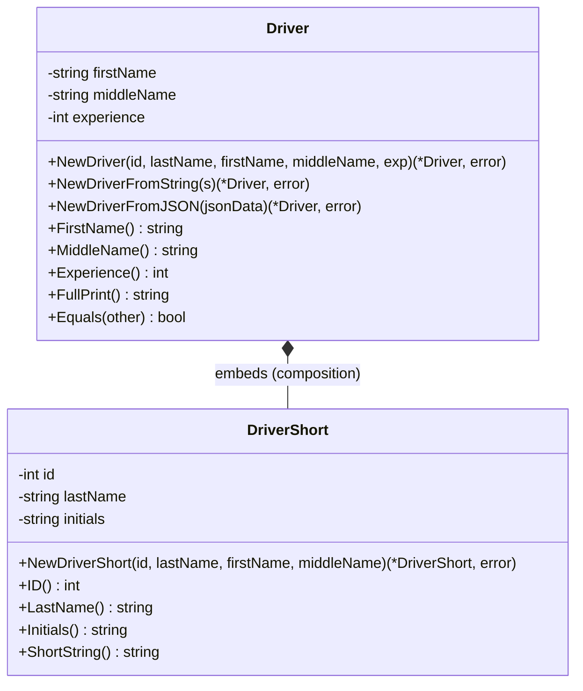

```mermaid
classDiagram
    class DriverShort {
        -int id
        -string lastName
        -string initials
        +NewDriverShort(id, lastName, firstName, middleName) (*DriverShort, error)
        +ID() int
        +LastName() string
        +Initials() string
        +ShortString() string
    }

    class Driver {
        -string firstName
        -string middleName
        -int experience
        +NewDriver(id, lastName, firstName, middleName, exp) (*Driver, error)
        +NewDriverFromString(s) (*Driver, error)
        +NewDriverFromJSON(jsonData) (*Driver, error)
        +FirstName() string
        +MiddleName() string
        +Experience() int
        +FullPrint() string
        +Equals(other) bool
    }

    Driver *-- DriverShort : embeds (composition)
```
