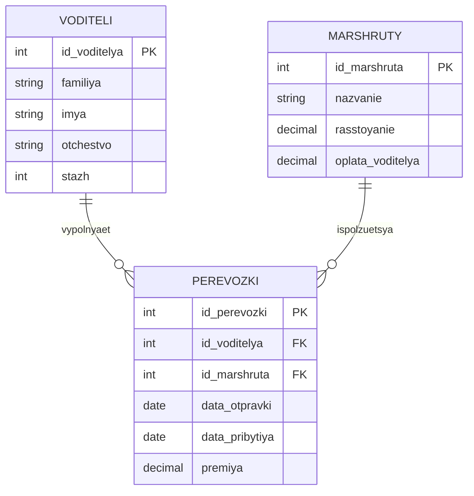

# ER-модель предметной области «грузоперевозки»

## Независимая сущность с наибольшим числом полей

Выбран **Водитель** — 4 атрибута (фамилия, имя, отчество, стаж), у Маршрута их 3 (название, расстояние, оплата).

## Сущности и атрибуты

### Водители
| Атрибут | Тип | Ключ |
|---|---|---|
| id_водителя | int | PK |
| фамилия | string | |
| имя | string | |
| отчество | string | |
| стаж | int | |

### Маршруты
| Атрибут | Тип | Ключ |
|---|---|---|
| id_маршрута | int | PK |
| название | string | |
| расстояние | decimal | |
| оплата_водителя | decimal | базовая ставка оплаты за этот маршрут |

### Перевозки
| Атрибут | Тип | Ключ |
|---|---|---|
| id_перевозки | int | PK |
| id_водителя | int | FK → Водители |
| id_маршрута | int | FK → Маршруты |
| дата_отправки | date | |
| дата_прибытия | date | |
| премия | decimal | необязательное поле, 0 или NULL, если премии не было |

## Связи

- Водители 1—∞ Перевозки (один водитель выполняет много перевозок)
- Маршруты 1—∞ Перевозки (один маршрут используется во многих перевозках)

## ER-диаграмма (mermaid)

## Обоснование 3НФ

- В **Водители** и **Маршруты** все неключевые атрибуты зависят только от первичного ключа, транзитивных зависимостей нет.
- **Перевозки** фиксирует факт конкретного рейса конкретного водителя по конкретному маршруту в конкретные даты. Оплата за перевозку не хранится как константа в Водителях или Маршрутах, а вычисляется через связь с маршрутом; премия — отдельный факт, привязанный именно к перевозке.
- Название и расстояние маршрута не дублируются в каждой перевозке, а вынесены в отдельную таблицу — это исключает аномалии обновления: при уточнении расстояния маршрута меняется одна строка, а не все связанные перевозки.

Итоговая стоимость перевозки = оплата_водителя (из Маршрутов) + премия (из Перевозки, если была).
