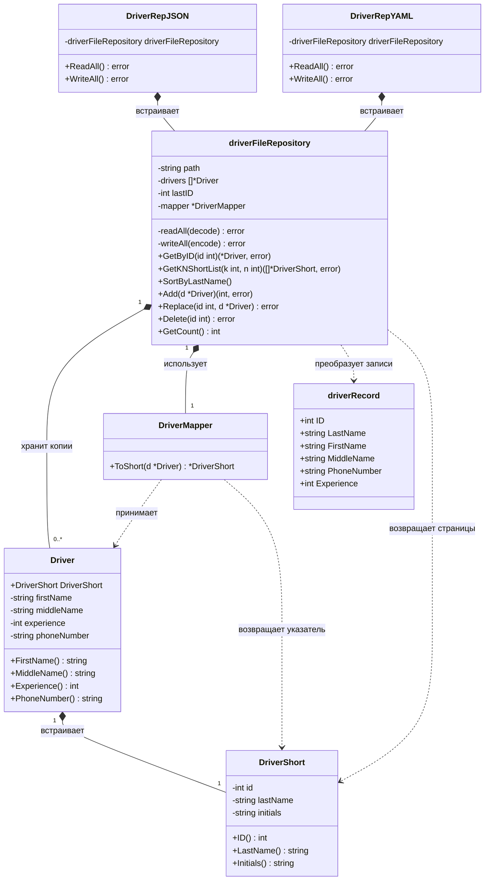

```mermaid
classDiagram
    class Driver {
        +DriverShort DriverShort
        -string firstName
        -string middleName
        -int experience
        -string phoneNumber
        +FirstName() string
        +MiddleName() string
        +Experience() int
        +PhoneNumber() string
    }

    class DriverShort {
        -int id
        -string lastName
        -string initials
        +ID() int
        +LastName() string
        +Initials() string
    }

    class DriverMapper {
        +ToShort(d *Driver) *DriverShort
    }

    class driverFileRepository {
        -string path
        -drivers []*Driver
        -int lastID
        -mapper *DriverMapper
        -readAll(decode) error
        -writeAll(encode) error
        +GetByID(id int) (*Driver, error)
        +GetKNShortList(k int, n int) ([]*DriverShort, error)
        +SortByLastName()
        +Add(d *Driver) (int, error)
        +Replace(id int, d *Driver) error
        +Delete(id int) error
        +GetCount() int
    }

    class DriverRepJSON {
        -driverFileRepository driverFileRepository
        +ReadAll() error
        +WriteAll() error
    }

    class DriverRepYAML {
        -driverFileRepository driverFileRepository
        +ReadAll() error
        +WriteAll() error
    }

    class driverRecord {
        +int ID
        +string LastName
        +string FirstName
        +string MiddleName
        +string PhoneNumber
        +int Experience
    }

    Driver "1" *-- "1" DriverShort : встраивает
    DriverRepJSON *-- driverFileRepository : встраивает
    DriverRepYAML *-- driverFileRepository : встраивает
    driverFileRepository "1" *-- "0..*" Driver : хранит копии
    driverFileRepository "1" *-- "1" DriverMapper : использует
    driverFileRepository ..> driverRecord : преобразует записи
    driverFileRepository ..> DriverShort : возвращает страницы
    DriverMapper ..> Driver : принимает
    DriverMapper ..> DriverShort : возвращает указатель
```

Диаграмма отражает пункты 1, 2 и 3 ЛР2. Методы моделей первой лабораторной
показаны в сокращённом виде; полная диаграмма ЛР1 находится в
[driver_class_diagram.md](driver_class_diagram.md).

`NewDriverRepJSON(path)` и `NewDriverRepYAML(path)` создают пустые репозитории.
Это функции пакета `file`, возвращающие указатель на соответствующий тип
и ошибку. Для загрузки файла нужно вызвать `ReadAll`.

`DriverRepJSON` и `DriverRepYAML` встраивают `driverFileRepository`. Методы
поиска, сортировки, пагинации и изменения списка определены в общем типе и
доступны у обоих репозиториев. Это аналог наследования поведения через
встраивание в Go. На диаграмме показана композиция.

Общий тип читает и записывает файл. Каждый репозиторий передаёт ему функции
преобразования `driverRecord` в свой формат и обратно. При загрузке общий
тип создаёт `Driver` через конструктор с валидацией.

Маппер возвращает указатель на встроенную модель. Репозиторий копирует
полученный `DriverShort`, чтобы изменение результата не затрагивало его список.
